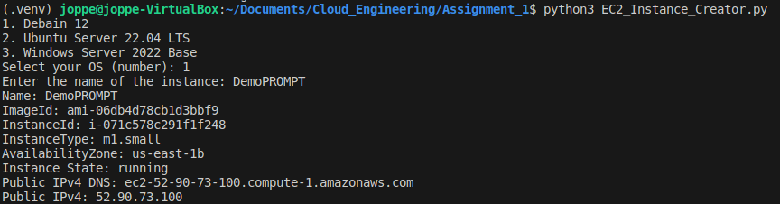
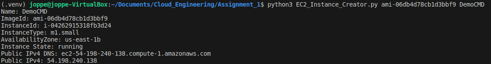
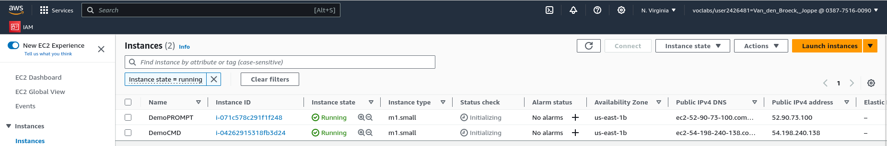

# Assignment 1: AWS Deployment Challenge 2
Voor de eerste opdracht van het vak Cloud Engineering werd gevraagd om een Python-script te schrijven dat met behulp van de AWS SDK een EC2-instantie aanmaakt in de AWS Cloud.
## Voorbereiding
Eerst wordt er een virtuele omgeving opgezet waarin de aanvullende software wordt geïnstalleerd. Deze map wordt later vermeld in het .gitignore-bestand, zodat de SDK niet wordt gekopieerd naar de repository.
```
python3 -m venv .venv
```
Vervolgens wordt de omgeving geactiveerd en wordt de AWS SDK (boto3) geïnstalleerd met behulp van pip3.
```
source .venv/bin/activate
pip3 install boto3
```
## AWS Credentials
Een probleem bij deze opdracht is het doorgeven van de AWS Credentials. Wegens beveiligingsredenen worden AWS Credentials nooit in het script zelf opgeslagen. De oplossing hiervoor is al inbegrepen in de SDK. 

Boto3 kan de credentials ophalen uit een lokaal bestand, mits dit het juiste pad heeft. Hierdoor blijven deze gegevens lokaal en beter beschermd. Via boto3 kun je ook werken met verschillende profielen. Als er geen specifiek profiel wordt meegegeven bij het aanmaken van het object, gebruikt boto3 het standaardprofiel
```
~/.aws/credentials
```
```
# EC2 client object
ec2_client = boto3.client("ec2")
```
## Code
Elke lijn code in het script is voorzien van een commentaarregel die uitlegt wat de code doet. Hieronder staan enkele delen van de code die extra uitleg nodig hebben.
### Imports
Hier worden de benodigde modules geïmporteerd:
- boto3: een SDK die wordt gebruikt om AWS-resources te beheren of aan te maken.
- sys: een module die wordt gebruikt om argumenten van de terminal door te geven aan het Python-script.
```
import boto3
import time
import sys
```
### Arguments
Dit deel wordt gebruikt om te bepalen of de gebruiker argumenten meegeeft in de terminal. Er is ook validatie ingebouwd om te controleren of de gebruiker het juiste aantal argumenten opgeeft.

De argumenten worden opgehaald met behulp van de module `sys`. Deze module heeft een functie genaamd `argv` die een lijst creëert met alle argumenten, inclusief de naam van het script.

Vervolgens worden de relevante argumenten uit de lijst gehaald en toegewezen aan variabelen. Als er geen argumenten worden meegegeven, zal het script een prompt weergeven waar de gebruiker zijn besturingssysteem en naam kan kiezen.

```
    # check if arguments are passed
    if len(sys.argv) > 1:
        # check if 2 arguments are passed
        if len(sys.argv) == 3:
            ami = sys.argv[1]
            name = sys.argv[2]
        # incorrect amount of arguments
        else:
            raise Exception("The number of arguments is in correct. Only pass 2 arguments (AMI ID and name)!")
```

### Creation and getting info
Tot slot wordt de EC2 aangemaakt met de gewenste waarden (naam en AMI). Ook worden het minimum- en maximumaantal meegegeven omdat dit verplichte waarden zijn bij deze functies.

Omdat de EC2 niet direct in de running status is, wordt er gebruikgemaakt van een 'sleep'-functie om even te wachten. Hierna wordt de informatie opgehaald van de EC2-instance via de InstanceID. Vervolgens worden de gegevens gefilterd zodat alleen de belangrijke waarden overblijven.

De output toont:
- Naam
- Instance ID
- Instance type
- Availability zonde
- Instance state
- Public IPv4 DNS
- Public IPv4

## Resultaat
### Zonder parameters

### Met parameters

### AWS

## AI
Ik heb in mijn opdracht enkel gebruik gemaakt van Bing AI omdat deze GPT-4 gebruikt en vaak ook recenter gegevens gebruik dan ChatGPT. Hieronder vindt u alle prompts die ik heb gebruikt om mijn opdracht op te lossen.
## Prompt 1
### Vraag
i'm a student Cloud and Cyber Security. I would like to make a python script that makes an EC2 instance in AWS. The scripts needs to ask the user for the OS he wants and the name of the instance. The rest of the values should remain default. At the end of the script there needs to be a print with all the basic info about the EC2 instance (Public IPv4, InstanceID, ...). The script needs to use boto3.
### Antwoord
That sounds like a great project! Here’s a high-level overview of what you need to do:

Install the boto3 library in your Python environment.
Use the boto3 library to create an EC2 instance in AWS.
Prompt the user for the OS they want and the name of the instance.
Use the user input to configure the EC2 instance.
Print out all the basic info about the EC2 instance at the end of the script.
Here’s an example code snippet that should help you get started:

Python
Deze code wordt door AI gegenereerd. Controleer en gebruik zorgvuldig. Ga naar onze veelgestelde vragen voor meer informatie.
```
import boto3

# Create an EC2 client
ec2 = boto3.client('ec2')

# Prompt user for OS and instance name
os = input("Enter OS: ")
name = input("Enter instance name: ")

# Create EC2 instance
response = ec2.run_instances(
    ImageId='ami-0c94855ba95c71c99', # Replace with your own AMI ID
    InstanceType='t2.micro',
    KeyName='my-key-pair',
    MaxCount=1,
    MinCount=1,
    SecurityGroupIds=[
        'sg-01234567890abcdef', # Replace with your own security group ID
    ],
    UserData='''#!/bin/bash
                echo "Hello, World!" > index.html
                nohup python -m SimpleHTTPServer 80 &''',
    TagSpecifications=[
        {
            'ResourceType': 'instance',
            'Tags': [
                {
                    'Key': 'Name',
                    'Value': name,
                },
            ],
        },
    ],
)

# Get instance ID and public IP address
instance_id = response['Instances'][0]['InstanceId']
public_ip = response['Instances'][0]['PublicIpAddress']

# Print out basic info about EC2 instance
print(f"Instance ID: {instance_id}")
print(f"Public IPv4: {public_ip}")
```
This code creates an EC2 instance using a pre-defined Amazon Machine Image (AMI), security group, and user data. It prompts the user for the OS and instance name, which are then used to configure the EC2 instance. Finally, it prints out the instance ID and public IPv4 address.

You can modify this code to suit your specific needs. For example, you can prompt the user for additional configuration options or use a different AMI.

I hope this helps! Let me know if you have any questions.
### Verklaring
Eerst heb ik geprobeerd om een prompt te schrijven die zoveel mogelijk informatie zou opleveren. Hierdoor kon ik snel een basis krijgen van hoe het proces juist in zijn werk ging.

Nadat ik het antwoord had geanalyseerd, ben ik begonnen te experimenteren met de parameters. Eerst liet ik alles weg buiten de naam en AMI ID. Hierdoor kreeg ik een foutmelding dat MinCount en MaxCount ook verplicht waren.

Dankzij deze prompt kon ik code schrijven die een EC2-instance aanmaakte.

Er waren nog wel problemen met de output, waardoor ik dit stuk niet heb gebruikt. Maar een deel ervan komt later wel van pas bij mijn oplossing.
## Prompt 2
### Vraag
How do i retrieve information about an EC2 instance if i have the instanceID
### Antwoord
You can use the boto3 library to retrieve information about an EC2 instance if you have the instance ID. Here’s an example code snippet that should help you get started:

Python
Deze code wordt door AI gegenereerd. Controleer en gebruik zorgvuldig. Ga naar onze veelgestelde vragen voor meer informatie.
```
import boto3

# Create an EC2 client
ec2 = boto3.client('ec2')

# Prompt user for instance ID
instance_id = input("Enter instance ID: ")

# Retrieve information about EC2 instance
response = ec2.describe_instances(InstanceIds=[instance_id])

# Extract relevant information from response
public_ip = response['Reservations'][0]['Instances'][0]['PublicIpAddress']
private_ip = response['Reservations'][0]['Instances'][0]['PrivateIpAddress']
instance_type = response['Reservations'][0]['Instances'][0]['InstanceType']
state = response['Reservations'][0]['Instances'][0]['State']['Name']

# Print out basic info about EC2 instance
print(f"Instance ID: {instance_id}")
print(f"Public IPv4: {public_ip}")
print(f"Private IPv4: {private_ip}")
print(f"Instance type: {instance_type}")
print(f"State: {state}")
```

This code prompts the user for the instance ID, retrieves information about the EC2 instance using describe_instances, and extracts relevant information from the response. Finally, it prints out basic info about the EC2 instance, including its public and private IPv4 addresses, instance type, and state.

You can modify this code to suit your specific needs. For example, you can prompt the user for additional information or extract different fields from the response.

I hope this helps! Let me know if you have any questions.
### Verklaring
Omdat ik via de vorige prompt weet hoe ik de instance-ID kan ophalen van een pas aangemaakte instance, heb ik gewoon de instance-ID in deze prompt vervangen door de ID van de zojuist aangemaakte instance.

Hierna heb ik eerst de volledige output afgedrukt en deze bestudeerd voordat ik de informatie verder ging ontleden. Zodra ik de output begreep, heb ik de belangrijkste informatie eruit gehaald.

Omdat deze functie ervan uitgaat dat de instance al volledig is opgestart, moest ik een 'sleep'-functie gebruiken, anders zou het script vastlopen op het Public IPv4-adres.

## Prompt 3
### Vraag
how to safely pass aws credentials to a python script with boto3
### Antwoord
There are several ways to safely pass AWS credentials to a Python script that uses boto3. Here are some best practices:

Do not store credentials in code: Storing credentials in code is a security risk. Instead, store them in a secure storage like Secret Manager or Hashicorp Vault.

Use environment variables: You can pass AWS credentials to your Python script using environment variables. This is a secure way to pass credentials because environment variables are not stored in code.

Use IAM roles: Whenever possible, use IAM roles to connect to AWS services. IAM roles provide temporary security credentials that are automatically rotated and do not need to be stored in code.

Use AWS CLI configuration files: You can store your AWS credentials in the AWS CLI configuration file (~/.aws/credentials). boto3 will automatically use these credentials when you run your Python script.

Here’s an example of how you can use the boto3 library to connect to AWS services using environment variables:

Python
Deze code wordt door AI gegenereerd. Controleer en gebruik zorgvuldig. Ga naar onze veelgestelde vragen voor meer informatie.
```
import os
import boto3

# Set environment variables
os.environ['AWS_ACCESS_KEY_ID'] = 'your_access_key_id'
os.environ['AWS_SECRET_ACCESS_KEY'] = 'your_secret_access_key'

# Create an S3 client
s3 = boto3.client('s3')

# Use the S3 client to perform operations
response = s3.list_buckets()

# Print the response
print(response)
```

This code sets the AWS_ACCESS_KEY_ID and AWS_SECRET_ACCESS_KEY environment variables, creates an S3 client using boto3, and uses the client to list all the buckets in your account.

You can modify this code to suit your specific needs. For example, you can use different environment variable names or connect to a different AWS service.

I hope this helps! Let me know if you have any questions.
### Verklaring
Omdat ik momenteel al mijn code aan het testen was met mijn AWS credentials hard gecodeerd in de declaratie van de boto3-client, wilde ik hiervoor een oplossing vinden.

Bij punt 4 staat dat boto3 automatisch de waarde ophaalt uit het bestand ~/.aws/credentials. Ik heb dit uitgeprobeerd en dit blijkt perfect te werken.

Hierna ben ik nog in de documentatie van boto3 gaan zoeken en kwam tot de ontdekking dat het mogelijk is om meerdere credentials te hebben en verschillende profielen op te stellen. Voor deze opdracht heb ik besloten om gewoon met het default te werken.

## Prompt 4
### Vraag
How do i pass values to a pyton script using terminal
### Antwoord
You can pass values to a Python script using terminal by providing command-line arguments. Here’s an example of how you can pass two arguments to a Python script:

python my_script.py arg1 arg2

In this example, my_script.py is the name of your Python script, arg1 and arg2 are the two arguments you want to pass.

You can access these arguments in your Python script using the sys.argv list. Here’s an example:

Python
Deze code wordt door AI gegenereerd. Controleer en gebruik zorgvuldig. Ga naar onze veelgestelde vragen voor meer informatie.
```
import sys

# Get the command-line arguments
arg1 = sys.argv[1]
arg2 = sys.argv[2]

# Print the arguments
print(f"Argument 1: {arg1}")
print(f"Argument 2: {arg2}")
```
This code gets the two command-line arguments using sys.argv, assigns them to variables, and prints them out.

You can modify this code to suit your specific needs. For example, you can pass more or fewer arguments, or use different variable names.

I hope this helps! Let me know if you have any questions.
### Verklaring
Door deze oplossing wist ik dat `sys.argv[]` een lijst was waardoor ik met de lengte kon bepalen of de gebruiker argumeneten had meegegeven of niet. 

Tot slotte zag ik ook duidelijk in de oplossing hoe ik de argumenten moest doorgeven in de terminal.
## Extra bronnen
https://boto3.amazonaws.com/v1/documentation/api/latest/reference/services/ec2.html
